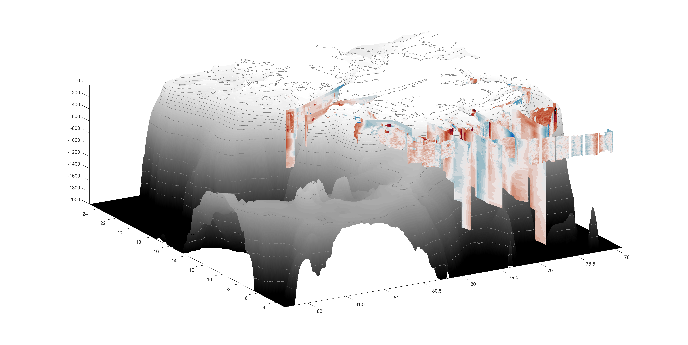

# Processing and analysis of vessel mounted and lowered ADCP datasets

This document will guide you through the steps necessary to process and  analyse both vessel mounted (VM-ADCP) and lowered acoustic doppler current profilers (L-ADCP). Both are complex data sources that contain a lot of noise and potential biases, but dont despair, with todays programms and code packages anyone can work with this data and produce meaningfull results. 

We used the following data sources:

from the field:
- VM-ADCP: RDI Workhorse 75 kHz and 150 kHz (http://www.teledynemarine.com/workhorse-mariner-adcp?BrandID=16)
- L-ADCP: RDI Workhorse Sentinel 300kHz (http://www.teledynemarine.com/workhorse-sentinel-adcp?BrandID=16)
- Sea Bird 911plus CTD profiles (http://www.seabird.com/sbe911plus-ctd) 

from the web:
- International Bathymetric Chart of the Arctic Ocean IBCAO (https://www.ngdc.noaa.gov/mgg/bathymetry/arctic/arctic.html)
- Global coastline dataset (https://www.ngdc.noaa.gov/mgg/shorelines/data/gshhs/)

We used the following software:

Data collection:
- VMDAS ADCP data collection software (http://www.teledynemarine.com/rdi/support#)
- Sea Bird CDT data collection suite (Seaterm, Seasave, SBE Data processing, http://www.seabird.com/sbe911plus-ctd)
    
Post processing:
- Oracle VM VirtualBox 5.0 running a UNIX machine with the CODAS ADCP processing suite (https://currents.soest.hawaii.edu/docs/adcp_doc/codas_doc/)

Analysis:
- Matlab 2016a, incl. the mapping and statistics toolbox and the following additional packages
- m_map (https://www.eoas.ubc.ca/~rich/map.html)
- seawater liberary (http://www.cmar.csiro.au/datacentre/ext_docs/seawater.htm)
- objective mapping (http://mooring.ucsd.edu/software/matlab/doc/toolbox/datafun/objmap.html)
- L-ADCP processing suite LDEO (http://www.ldeo.columbia.edu/~ant/LADCP)

Here is a visualization of VM-ADCP and L-ADCP durrent profiles:



# Fieldwork

This section explains how ADCP data was gathered during each expedition.

## VM-ADCP

The VM-ADCP is usualy mounted in the ships hull or a retractable keel, and connected to an onboard PC. To record data one of two proramms is usually used: The Windows programm VMDAS (Vesse mounted data aquisition system) from RDI instruments or the open source suite UHDAS from the University of Hawaii. 


Here we used VMDAS to collect VM-ADCP data. After starting up the PC and ensuring the PC is properly connected to the ADCP and the ships navigation channels, one can open the VMDAS and select the button: File--> Collect Data. This will open some empty diagrams. The next step is to edit the data options under: Options --> Edit data options. In the first section "Communications" the ADCP and NMEA (navigation) data channels need to be set to the right ports, but the ships technician likely did this already. In the next section "ADCP setup" you need to select the bin number and size. This depends on the frequency of the ADCP. We used 100 bins with a binsize of 8 m and 8 ms paceing between the bins. The ADCP also requires a specific set up file, which states details of the ADCPs mounting and ping-ing patters. This is usually avialable from the ships technician or stored on the data collection PC. Here is an example from RV Helmer Hanssen:

```
-----------------------------------------------------------------------------\
; ADCP Command File for use with VmDas software.
; 
; ADCP type:     75 Khz Ocean Surveyor
; Setup name:    default
; Setup type:    Low resolution, long range profile(narrowband)
; 
; NOTE:  Any line beginning with a semicolon in the first 
;        column is treated as a comment and is ignored by 
;        the VmDas software.
;
; NOTE:  This file is best viewed with a fixed-point font (e.g. courier).
; Modified Last: 12August2003
;----------------------------------------------------------------------------/

; Restore factory default settings in the ADCP
cr1

; set the data collection baud rate to 38400 bps, 
; no parity, one stop bit, 8 data bits
; NOTE:  VmDas sends baud rate change command after all other commands in 
; this file, so that it is not made permanent by a CK command.
cb611

;
;
;	CX Trigger input, default is CX0,0 no trigging
;      
;	CX1,0 waits for a positive trigging signal
CX1,0
;
;

; Set for narrowband single-ping profile mode (NP), hundred (NN) 8 meter bins (NS), 
; 8 meter blanking distance (NF)
WP0
NN100
NP00001
NS0800
NF0800

; Disable single-ping bottom track (BP), 
; Set maximum bottom search depth to 1000 meters (BX)
BP000
BX10000

; output velocity, correlation, echo intensity, percent good
ND111110000

; One second between bottom and water pings
TP000000

; Zero seconds between ensembles
; Since VmDas uses manual pinging, TE is ignored by the ADCP.
; You must set the time between ensemble in the VmDas Communication options
TE00000000

; Not set to calculate speed-of-sound, no depth sensor, external synchro heading 
; sensor, no pitch or roll being used, no salinity sensor, use internal transducer 
; temperature sensor
EZ0000001
;
; Sets the speed of sound to 1500m/s
;
EC1500
; Output beam data (rotations are done in software)
EX00000

; Set transducer misalignment (hundredths of degrees)
EA04530

; Set transducer depth (decimeters)
ED0042

; Set Salinity (ppt)
ES35

; save this setup to non-volatile memory in the ADCP
CK
```
The next section "Recording" includes setting the naming and storage options for the data. The section "NAV" lets you select the correct NMEA channels to co-record with the ADCP data. Storing the correct NMEA data is important for the postprocessing, since we want to remove biases that stem from the ships movement. The other sections are less important and you can now press the OK button and start recording ADCP data by pressing the play button in the upper left corner. 

During the expedition  make sure that the ADCP does not interfer with other acoustic sensors, and adjust the pining intervals if necessary. 

At the end of the expedition, open the data collection folder and copy the entire folder onto you post processing PC. We need especially the ENR, N1R and N2R files. 

# Post processing of the VM-ADCP data

```Matlab
a(i))=var(23)
```
